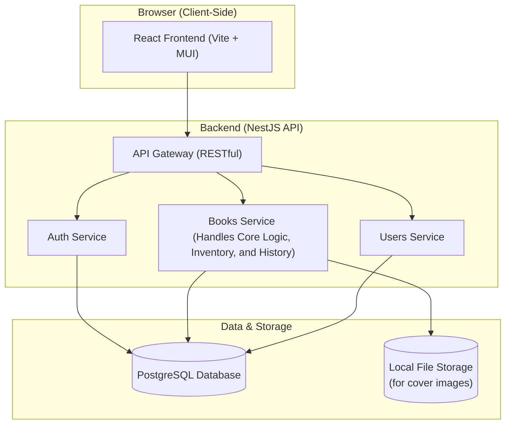

# Full-Stack Book Library Management System

This is a complete, full-stack application for a book library management system. It features a modern backend API built with **NestJS** and a reactive frontend user interface built with **React** and **Material-UI**. The system is containerized with Docker for easy setup and deployment, and it includes robust role-based authentication, inventory management, and a complete borrowing/returning workflow.

## Core Technologies

| Area      | Technology                                                                                                  |
| :-------- | :---------------------------------------------------------------------------------------------------------- |
| **Backend**   | **NestJS**, **TypeScript**, **PostgreSQL**, **TypeORM**, **JWT** (Passport.js), **Swagger** (OpenAPI)         |
| **Frontend**  | **React**, **TypeScript**, **Vite**, **Material-UI (MUI)**, **Axios**, **React Router**, **React Context API** |
| **DevOps**    | **Docker**, **Docker Compose**                                                                              |

## Key Features

-   **Role-Based Access Control (RBAC):** Three distinct user roles with granular permissions:
    -   **Member:** Can view, search, borrow, and return books.
    -   **Librarian:** All Member permissions, plus adding/updating books and viewing system-wide borrowing history.
    -   **Admin:** All Librarian permissions, plus creating new users with specific roles via the API.
-   **Secure JWT Authentication:** The API is secured with JSON Web Tokens, and the frontend handles token storage and route protection.
-   **Complete Book Management:** Full CRUD (Create, Read, Update, Delete) functionality for books, including cover image uploads.
-   **Inventory Tracking:** The system differentiates between a book's total `quantity` and its `availableQuantity`, which is automatically updated during borrowing and returning.
-   **Search and Pagination:** The frontend provides an intuitive interface to search for books by title or author, with results paginated for performance.
-   **Interactive API Documentation:** A live Swagger UI is automatically generated for exploring and testing API endpoints.
-   **Containerized Backend:** The backend and database are managed with Docker Compose, allowing for a one-command setup.
-   **Database Seeding & Migrations:** The database is automatically migrated to the correct schema and seeded with initial data on startup.

## System Architecture



---

## Getting Started

Follow these instructions to get the project up and running on your local machine.

### Prerequisites

You must have the following software installed on your system:
-   **Git**
-   **Node.js** (v18 or newer recommended) and **npm**
-   **Docker**
-   **Docker Compose**

### Installation and Setup

**Step 1: Clone the Repository**
Open your terminal and clone this project:
```sh
git clone <your-repository-url>
cd <project-directory>
```

**Step 2: Configure Backend Environment**
The backend requires a `.env` file for configuration.
1.  Navigate to the `backend` directory: `cd backend`
2.  Create a `.env` file by copying the example: `cp .env.example .env`
3.  Navigate back to the root directory: `cd ..`

*(Note: The default values in `.env.example` are already configured to work with Docker Compose, so no changes are necessary unless you have a custom setup.)*

**Step 3: Install Frontend Dependencies**
The frontend dependencies need to be installed on your local machine.
```sh
cd frontend
npm install
cd ..
```

**Step 4: Run the Full Application**
This process requires two separate terminal windows.

**Terminal 1: Start the Backend (API & Database)**
In your first terminal, from the project's root directory (where `docker-compose.yml` is), run:
```sh
docker-compose up --build -d
```
This command will:
1.  Build the Docker image for the NestJS API.
2.  Start the API and PostgreSQL containers.
3.  **Automatically run database migrations and seed it with default users and books.**

**Terminal 2: Start the Frontend (Development Server)**
In a new terminal window, navigate to the `frontend` directory and run the Vite development server:
```sh
cd frontend
npm run dev
```
This will start the React application and it will automatically connect to the backend API running in Docker.

**Step 5: Access the Application**
Once both parts are running, you can access the system:

-   **Frontend Application:** **[http://localhost:5173](http://localhost:5173)** (This should open in your browser automatically)
-   **Backend API:** [http://localhost:3000](http://localhost:3000)
-   **Swagger API Docs:** [http://localhost:3000/api-docs](http://localhost:3000/api-docs)

---

## Usage & Default Credentials

The database is seeded with three default users, one for each role. You can use these credentials to log in and test the application's features.

| Role      | Username    | Password      |
| :-------- | :---------- | :------------ |
| **Admin**     | `admin`     | `password123` |
| **Librarian** | `librarian` | `password123` |
| **Member**    | `member`    | `password123` |

## Running Backend Tests

You can execute the backend's unit and integration tests directly inside the running container.

-   **Run all tests:**
    ```sh
    docker-compose exec api npm test
    ```
    -   **Run tests with coverage report:**
    ```sh
    docker-compose exec api npm run test:cov
    ```

## License
This project is licensed under the UNLICENSED License.